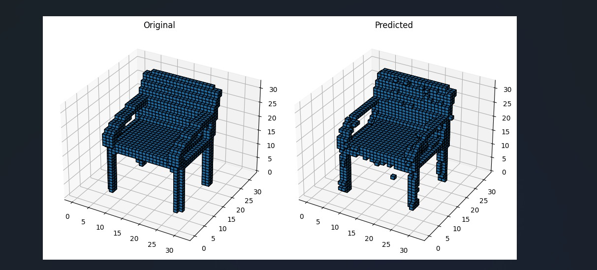
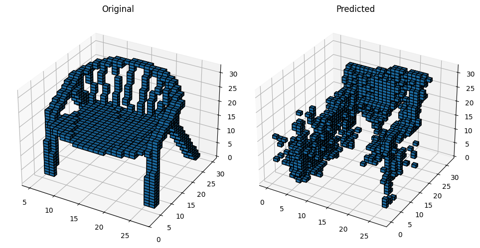

# 3D OBJECT GENERATIONS

This repository showcases implementations of two Generative Adversarial Network (GAN) techniques designed for generating 3D objects. It includes both a Variational Autoencoder-Generative Adversarial Network (VAE-GAN) and a Simple GAN architecture, providing an understanding of advanced and fundamental approaches to generative modeling.

---

## 🚀 Overview

Generative Adversarial Networks (GANs) are powerful deep learning models used to create synthetic data that closely resembles real-world datasets. In this project, we focus on generating 3D objects using two distinct techniques:
1. **VAE-GAN** - Combines the representational power of Variational Autoencoders (VAEs) with the generative capabilities of GANs for producing high-quality 3D outputs with structured latent spaces.
2. **Simple GAN** - Implements a basic GAN framework to introduce the core concepts of adversarial training and 3D object generation.

---

## 🎯 Features

### 🔹 VAE-GAN
- Encodes data into a latent space with a Variational Autoencoder.
- Utilizes a GAN to generate high-fidelity 3D outputs.
- Includes a complete training pipeline and evaluation metrics.

### 🔹 Simple GAN
- Basic Generator and Discriminator setup.
- Easy-to-follow training loop.
- Visualizes generated 3D data for conceptual understanding.

---

## 📁 Project Structure

```
├── vaeGan.ipynb        # VAE-GAN implementation and experiments
├── simpleGan.ipynb     # Simple GAN implementation
├── data/               # Placeholder for datasets
├── voxel_outputs/      # Generated 3D outputs and results
├── image1.png          # Sample 3D object generated
├── image2.png          # Another sample 3D object generated
└── requirements.txt    # Dependencies
```

---

## 🛠️ Dependencies

Make sure you have the following installed to run the notebooks:
- Python 3.x
- PyTorch
- NumPy
- Matplotlib
- Scikit-learn

Install them easily using:

```bash
pip install -r requirements.txt
```

---

## 📌 Usage

1. Place your dataset in the appropriate `data/` directory.
2. Update dataset paths and hyperparameters in the notebooks as needed.
3. Run the notebooks (`vaeGan.ipynb` and `simpleGan.ipynb`) cell by cell to train and generate 3D objects.

---

## 🖼️ Sample Results

Below are examples of 3D objects generated through these GAN techniques:

| Generated Output               | Description                      |
| ------------------------------ | -------------------------------- |
|          | 3D object sample from VAE-GAN    |
|          | 3D object sample from Simple GAN |

All output files and generated models are stored in the `voxel_outputs/` directory.

---

## 📚 Acknowledgments

These implementations are inspired by key research in the field of GANs, notably:
- "Generative Adversarial Nets" - the original GAN paper.
- "Autoencoding beyond Pixels using a Learned Similarity Metric" - the VAE-GAN paper.

Special thanks to the open-source community and research publications that laid the groundwork for this project.

---

## 📝 License

This project is licensed under the [MIT License](LICENSE).
